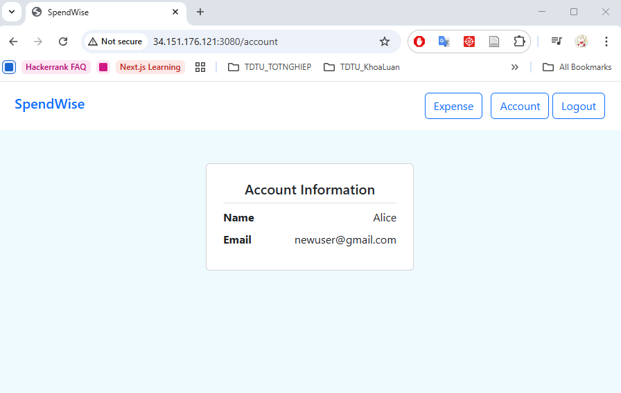
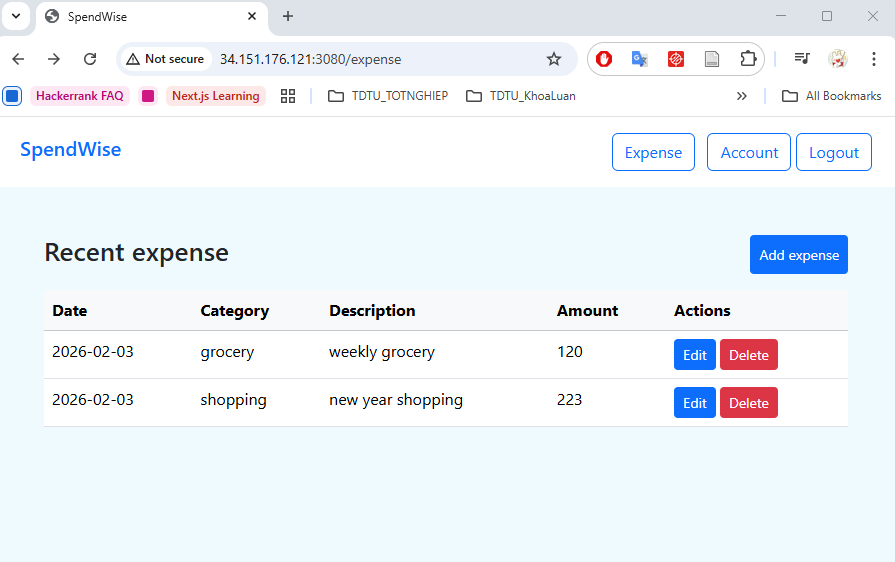

# SpendWise: SIT737-2025-Task 11.1HD

SpendWise is a cloud-native application project that enables users to manage and monitor personal expenses.
It provides tools for tracking spending over time.

The system is built with a MongoDB database, modular microservices containerized via Docker, and deployed to Google Cloud.

The project is configured **CI with GitHub Actions**, any update on main branch will automatically trigger the test, build new image and push to **Docker Hub**
> GKE deployment will be done manually due to limited permission of provided GCP account restricting automated deployment.




# About the project
The cloud‑native application consists of three services: frontend, account, and expense.
- The **frontend** acts as the **main entry point**, exposed via an **external IP address** and accessed by users. It communicates with the account and expense services to process user requests.
- The **account and expense services** communicate with the frontend and with each other through **cluster IPs**, restricting external access.
- The application uses a **centralized authentication system with JWT**, requiring all protected resources to verify user credentials through the dedicated account service before granting access. This ensures secure and **consistent authorization across all microservices**.


# CI-CD pipeline

CI/CD workflow is created using GitHub Actions. However, due to limited permission, **CI/CD workflow stop at publishing image to Docker Hub**.
- Current workflow is: commit & push -> trigger auto testing -> auto build image -> auto publish to Docker Hub
- The later step after publishing image is apply changes to GKE. The example of workflow configuration is commented at `.github/workflows/docker-image-accountsvc.yml`

As a workaround, below is an alternative solution for GKE deployment:
- Use the tag `autobuild` for automated-built image by GitHub Actions, avoid using original tag in deployment `.yaml` file in case the new image has error
- Manually apply the changes to GKE using `set image` and `rollout restart` commands. Below code is example for account service deployment
    ```bash
    # For first time using `autobuild` tag -> we need to set new image tag for deployed image
    kubectl set image deployment/accountsvc-deployment accountsvc-container=tut888/sit737-account-service:autobuild
    
    # For later updates -> we only need to restart the deployment to re-pull new image
    kubectl rollout restart deployment/accountsvc-deployment
    ```

# Instruction
## Start the application
### Run all with docker compose
- Start all services:
    ```bash
    docker compose up
    ``` 
- Access the application (frontend): `http://localhost:3380`

### Run individually
- Start service one by one (Account, Expense and Frontend):
    ```bash
    cd <service_directory>
    npm install
    npm start
    ```
- Access the application (frontend): `http://localhost:3081`

## Run the test
> **The project configured CI/CD with GitHub Actions, any update on main branch will automatically trigger the test and build new images.**
> - Account service & expense service: unit testing with Mocha/Chai
> - Frontend service: end to end testing with Cypress

For manually run the test, type below commmands
- Test backend services:
    ```
    cd <service_directory>
    npm test
    ```
- Test frontend:
    ```
    cd frontend
    npm run test:e2e
    ```

## Containerize with Docker
> Prerequisite: 
> - Docker Desktop must be installed
> - Detail instruction please refer to my documentation at [Docker Documentation](./docs/DOCKER.md)

Each service is developed separately in its own directory, with a corresponding Dockerfile.

Run the following commands to containerize all images at once
```bash
docker compose build
```

Tag the images and push them to Docker Hub:
```bash
docker tag spendwise-account-service <docker-username>/spendwise-account-service
docker push <docker-username>/spendwise-account-service

docker tag spendwise-expense-service <docker-username>/spendwise-expense-service
docker push <docker-username>/spendwise-expense-service

docker tag spendwise-frontend <docker-username>/spendwise-frontend
docker push <docker-username>/spendwise-frontend
```

## Deploy with Kubernetes
> Prerequisite: 
> - Docker Desktop must be installed, Kubernetes must be enabled. Alternatively, any other k8s engine such as Minikube can also be used for your preference.
> - Detail instruction please refer to my documentation at [Kubernetes Documentation](./docs/KUBERNETES.md)

### Deployment
> Detail instruction for **GCP deployment** please refer to my documentation at [GCP Documentation](./docs/GCP.md)

- Check and swith to your target **kubectl context**
    - Check context
        ```bash
        # Get all contexts
        kubectl config get-contexts

        # Check current context
        kubectl config current-context
        ```
    - Switch context
        ```bash
        # Option 1: Use docker desktop (local deployment)
        kubectl config use-context docker-desktop

        # Option 2: Use Google Cloud Platform (cloud deployment)
        kubectl config use-context gke_project-id_cluster-name_region 
        ```
- Navigate to your project directory where the deployment `.yaml` files are stored
    ```bash
    cd k8s/local
    ```
- Apply the MongoDB deployment:
    ```bash
    kubectl apply -f mongodb-pvc.yaml
    kubectl apply -f mongodb-secret.yaml
    kubectl apply -f mongodb-deployment.yaml
    ```
- Apply the service deployments
    ```bash
    kubectl apply -f frontendsvc-deployment.yaml
    kubectl apply -f accountsvc-deployment.yaml
    kubectl apply -f expensesvc-deployment.yaml
    ```

### Troubleshooting
During the deployment process, you may encounter various issues. Variety of commands can be used to troubleshoot and identify the root causes, some of them are
```bash
kubectl get <type>
kubectl describe <type> <target-name>
kubectl logs <pod-name>
```


